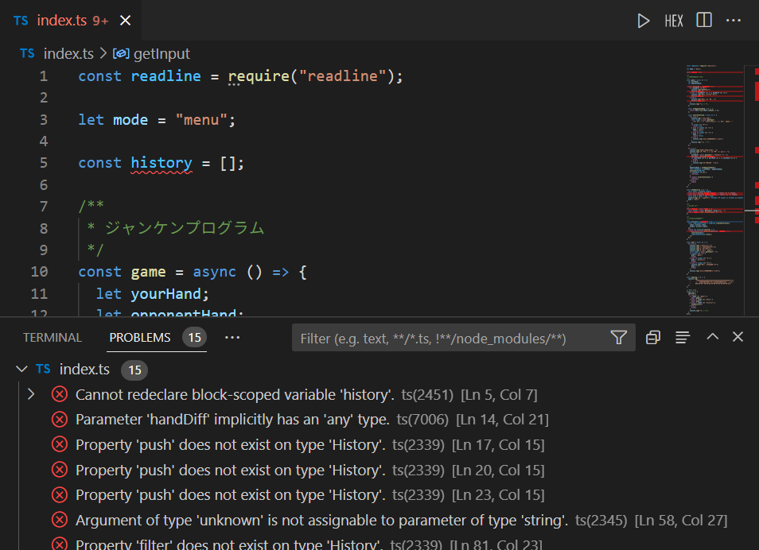

# TypeScript を書いてみよう

## 003. ペアプロ実践

このドキュメントでは、この題材にペアで取り組む場合の進め方の例を示します。  
取り組む時間や参加者のレベルによって最適な方法は変わってくるので、以下を参考に調整してみてください。

1. まずは動作を確認する
   `npm run play:js` で、JavaScript (index.js)が実行され、ジャンケンゲームの動作を確認できます。  
    まずは動かしてみて、動作を把握しておくことをお勧めします。

2. 操作共有ができるようにする  
   二人で同じコードを操作できるとスムーズなので、操作共有をしておくとよいです。  
   VSCode を利用している場合、`LiveShare` がおすすめです。  
   https://code.visualstudio.com/learn/collaboration/live-share

   エディタが異なる場合や、設定がうまくいかない場合は、AnyDesk などリモート操作アプリを利用するとよいです。  
   https://anydesk.com/ja

3. エラーを交互に修正していく  
   `npm run play` を実行すると、TypeScript のコンパイルと実行が行われます。  
   その際、エラーがあると、ターミナルにエラーが表示されます。  
   これをひとつずつ、交代で修正していきます。  
   ひとつずつ交代するのは、コードの修正を行う練習のためです。  
   また、エラーチェックの方法として、VS Code を利用している場合は `Problems` にもエラーの一覧が表示されます。

   

4. 修正が終わったら、リファクタリングをしてみる
   すべての修正が終わったら、リファクタリングに取り組んでみてください。  
   例えば...

   - `mode` が単なる String 型のため、意図しない内容が入ってしまうのを回避したい
   - `history` がグローバル変数になっているので、値を保護したい
   - `game()` 関数の中に責務が集中しているので、分散したい(クラス化・オブジェクト指向での実装)

5. 最後に、感想を共有する
   やってみた感想や、難しかったところ、印象に残った点などを共有しましょう。  
   言葉にしてみることで、記憶の定着になったり、お互いが気づいていなかった視点を得ることができます。
